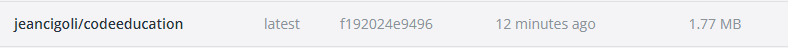

# Challenges

Repositório para guardar o desafio proposto no curso Full Cycle, onde terá dois desenvolvimentos:

## Desafio GO

Esse desafio é muito empolgante principalmente se você nunca trabalhou com a linguagem Go!
Você terá que publicar uma imagem no docker hub. Quando executarmos:

```cmd
docker run --rm jeancigoli/codeeducation
```

Temos que ter o seguinte resultado: Code.education Rocks!

O grande desafio é:

> **A imagem de nosso projeto Go precisa ter menos de 2MB =)**

E podemos dizer que o desafio foi cumprido:



Ao executar temos:


O **Dockerfile** se encontra dentro da pasta ./go.
