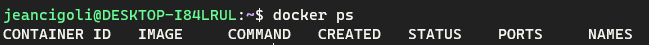
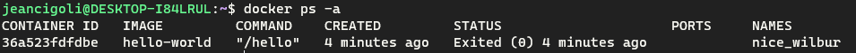
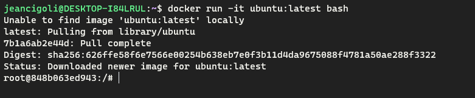
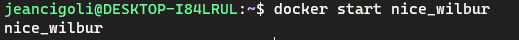
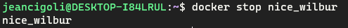

# Comandos

Readme para anotar comandos docker

- **Docker ps**: Listagem dos containers ativos.

- **Docker ps -a**: Listagem dos containers ativos ou que já foram executados e já morreram.

- **Docker run < image >**: Download da imagem passada, sempre será chamado um executável do container baixado.

- **Docker run -i < image >**: O -i significa interativo, ele irá manter o processo da minha imagem ativa.

- **Docker run -t < image >**: O -t significa tty, que consigo executar comandos dentro das imagens que vou rodar.

Com esses dois comandos é possível manter um base do ubuntu ativo, e executar comandos nele.

- **Docker start < image name >**: Reiniciar uma imagem que está deligada.

- **Docker stop < image name >**: Parar uma imagem que está ligada.

- **Docker run --rm < image name >**: Com a flag de --rm eu informo que quando o container parar de rodar é para excluí-lo.

