# Comandos

Readme para anotar comandos docker

- **Docker ps or docker container ls**: Listagem dos containers ativos.

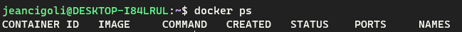

- **Docker ps -a**: Listagem dos containers ativos ou que já foram executados e já morreram.

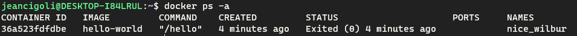

- **Docker run < image >**: Download da imagem passada, sempre será chamado um executável do container baixado.

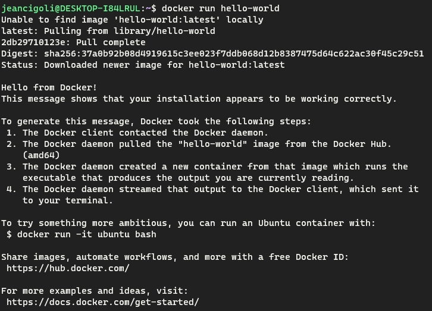

- **Docker run -i < image >**: O -i significa interativo, ele irá manter o processo da minha imagem ativa.

- **Docker run -t < image >**: O -t significa tty, que consigo executar comandos dentro das imagens que vou rodar.

Com esses dois comandos é possível manter um base do ubuntu ativo, e executar comandos nele.

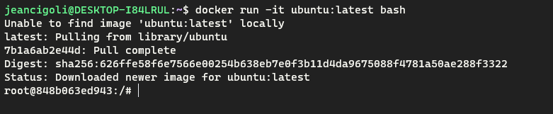

- **Docker start < image name >**: Reiniciar uma imagem que está deligada.

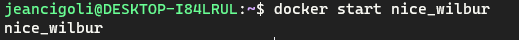

- **Docker stop < image name >**: Parar uma imagem que está ligada.

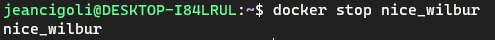

- **Docker run --rm < image name >**: Com a flag de --rm eu informo que quando o container parar de rodar é para excluí-lo.

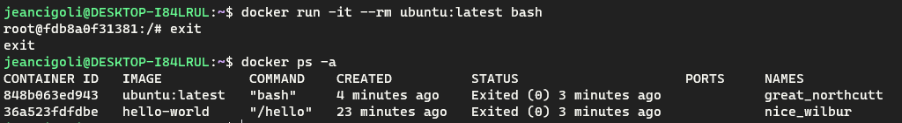

- **Docker run -p < port1 >:< port2 > nginx**: Assim conseguimos informar ao docker qual a porta que vou acessar da minha máquina e será redirecionado para a porta do container. Port1 é da nossa máquina; Port2 é do container;

- **Docker stop < id, name >**: Ele desliga o container.

- **Docker start < id, name >**: Ele liga o container novamente.

- **Docker rm < id >**: Ele remove o container .

- **Docker run -d --name nginx nginx**: Com o --name podemos nomear um container, assim evitando a geração de um nome estranho.

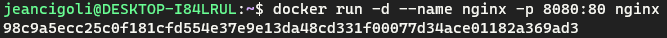

- **Docker exec < name > < command >**: Executa um comando dentro do container.

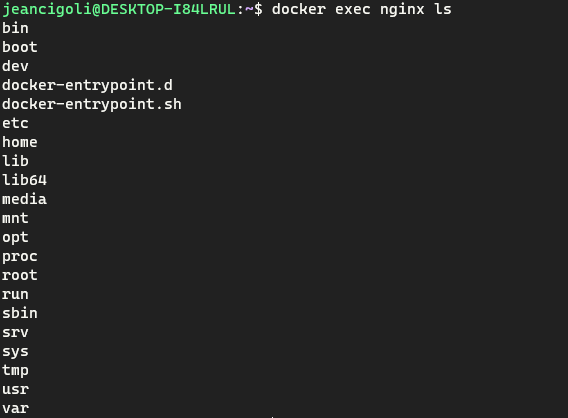

- **Docker run -d --name nginx -p 8080:80 -v /mnt/f/www/full-cycle/docker:/usr/share/nginx/html nginx**: Compartilhamento de arquivos entre minha máquina com o meu container.

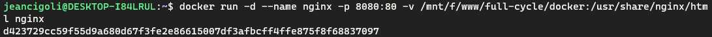

- **Docker run -d --name nginx -p 8080:80 --mount type=bind,source="$(pwd)"/html,target=/usr/share/nginx/html nginx**: Compartilhamento de arquivos com a nova estrutura de código.

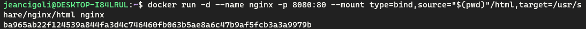

```docker
  Observação: A diferença do -v para o --mount é que o -v ele cria a pasta do caminho caso não exista, o --mount mostra um erro.

  "$(pwd)" = indica a pasta atual que estou na máquina.
```


- **Docker volume ls**: Lista os volumes criados no pc para dentro do docker.

 **Docker volume create < meuvolume >**: Cria um volume novo.


- **Docker images**: Lista as imagens que tenho instaladas no pc.

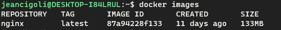

- **Docker rmi < image >:< tag >**: Remove a imagem instalada.
