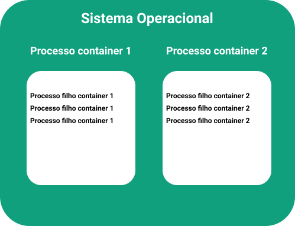
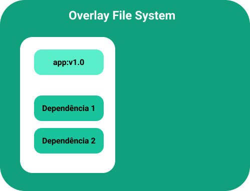
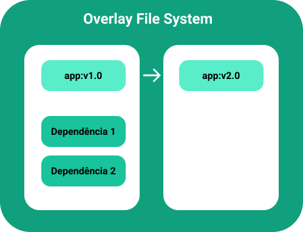

# Docker

Readme para estudo e anotações sobre docker e suas funcionalidades

## O que são containers?

**Tradução da explicação de container**

> Um container é um padrão de unidade de software que empacota código e todas as dependências de uma aplicação fazendo que a mesma seja executada rapidamente de forma confiável de uma ambiente computacional para o outro.

### Como ele funciona?

#### NAMESPACES

Os containers são processos, onde por meio de namespaces eles conseguem ficar isolados dentro do seu sistema operacional

- Namespaces: é uma forma de fazer o isolamento dos processos, com isso é possível ter um conjunto de processos.

Os processos só enxergam aquilo que está dentro dele, não visualiza nada fora do seu namespace.

Cada processo pode ter:

- Pid;

- Users: Divisões de usuários;

- Network: Isolamento de redes;

- File system.

Isso pode ser coberto por um namespace, assim ter um container completamente isolado

#### CGROUPS

Foi possível a organização de containers graças ao Cgroups, ele nada mais é do que um controlador de recursos.

Com isso podemos isolar os recursos computacionais dos meus container, assim definir que um container pode consumir apenas 500MB de memória.

#### OVERLAY FILE SYSTEM

Essa funcionalidade referencia o reaproveitamento de arquivos que já existem, exemplo:

Tenho um aplicação que possui duas dependências, atualmente ela está na versão 1.0

Desenvolvi uma nova funcionalidade e vou lançar a versão 2.0, o container junto com o overlay file system consegue realizar o reaproveitamento das dependências e atualizar apenas o que precisa. A segunda imagem só será gerada com o diferença das duas imagens.

E esse conceito serve também com o container aproveitando as dependências que já existe no sistema operacional, assim ele só tem os pedaços que ele precisa para funcionar, deixando o container leve.

---

In progress...
